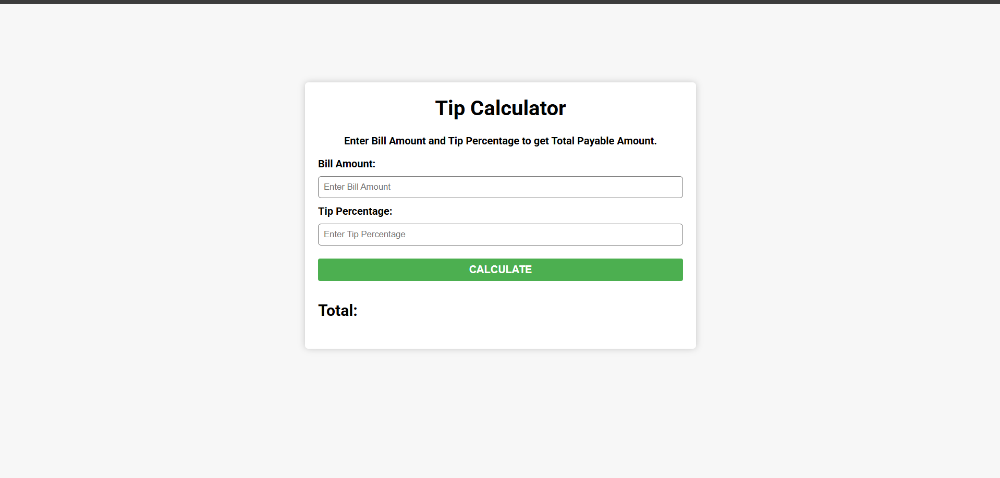

# 💰 Tip Calculator

A simple Tip Calculator built using HTML, CSS, and JavaScript.  
It helps users calculate the total bill amount including tip percentage.

---

## 🚀 Features

- Calculate total amount with tip
- Simple and clean UI
- Responsive design
- Input validation

---

## 🛠️ Technologies Used

- HTML
- CSS
- JavaScript

---

## 📂 Project Structure

```bash
├── index.html
├── style.css
├── app.js
└── favicon.ico
```

---

## ▶️ How to Run

1. Download or clone the repository

```bash
git clone https://github.com/dyaus4/tip-calculator.git
```

2. Open `index.html` in your browser

---

## 📖 How to Use

- Enter the bill amount
- Enter the tip percentage
- Click the **CALCULATE** button
- View the total payable amount

---

## 📸 Screenshot





---

## 👨‍💻 Author

Made with ❤️ by dyaus4